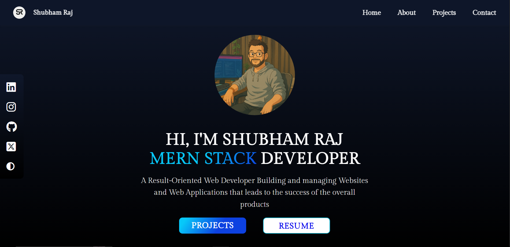
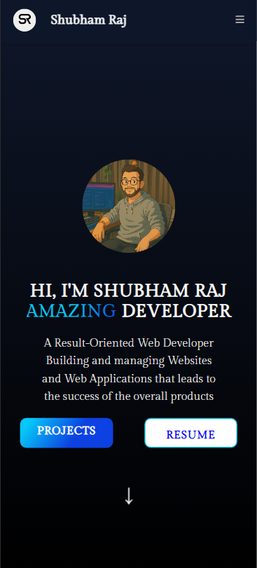

# 💼 My Portfolio

This is my first personal portfolio website showcasing my projects, skills, and background. It is built using:

- HTML
- Tailwind CSS
- JavaScript
- Font Awesome

## 🚀 Features

- Responsive design for all devices
- Smooth scroll and section-based layout
- Clean UI using Tailwind CSS
- Project showcase with icons and links
- Social media/contact links

## 📸 Preview

|  |  |  
  
## 🔧 Technologies Used

- HTML5  
- JavaScript
- Font Awesome

## 📂 Folder Structure

/  
├── index.html  
├── style.css  
├── cardstyle.css
├── script.js  
├── logos/  
│ └── (SVG icons and logos)  
├── Screenshots/
├ └──(preview images)  
└── README.md  

## 📬 Contact

Feel free to connect with me:

- LinkedIn: [[My linkdin profile](https://www.linkedin.com/search/results/all/?keywords=shubham&origin=GLOBAL_SEARCH_HEADER&sid=iBt)]
- GitHub: [[My GitHub profile](https://github.com/CSShubham)]
- Email: [raj07909@email.com]

---

Made with ❤️ by **Shubham Raj**
